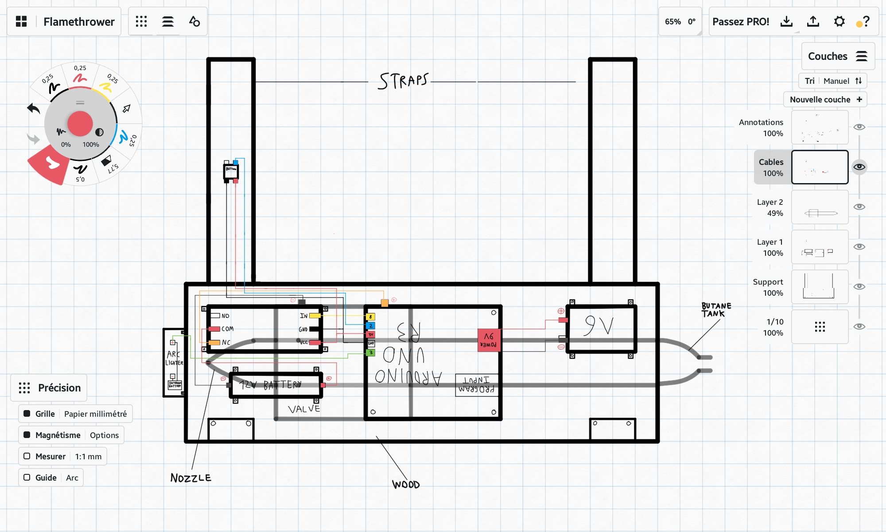

# Flamethrower Project

## ⚠️ Disclaimer
This project is extremely dangerous and involves handling highly flammable materials and creating flames. Attempting this project comes with significant risk to life and property. Proceed at your own risk. I am not responsible for any injuries, damages, or legal issues that may arise from attempting this project. Please adhere to all local laws and safety precautions.

---

## Materials Needed

### Electronics:
- **Arduino UNO R3**
- **Relay Module**
- **Solenoid Valve (12V)**
- **12V Battery** (to power the valve)
- **9V Battery** (to power the Arduino)
- **Pushbutton**
- **Jumper Wires**

### Mechanical:
- **Metal Tubes** (for flame projection)
- **Wood** (for mounting and base structure)
- **Epoxy Resin** (to secure components)

### Fuel:
- **Butane** (or any other flammable gas)

### Ignition:
- **Arc Lighter**

---

## Design Model

---

## Code
The Arduino code for this project is available in the repository under `code/main.ino`. Ensure you have the necessary libraries installed before uploading it to your Arduino UNO R3.

---

## Safety Precautions
1. Always wear protective gear, including gloves and goggles.
2. Test the device in a controlled, open environment away from flammable objects.
3. Keep a fire extinguisher nearby at all times.
4. Do not leave the device unattended when in operation.

---

## Contact Information
If you have any questions or would like to discuss this project further, feel free to contact me:

- **Mail**: helfandelias@gmail.com
- **Instagram**: [elias.helfand](https://www.instagram.com/elias.helfand)
- **LinkedIn**: [elias-helfand](https://www.linkedin.com/in/elias-helfand)

---

Thank you for checking out this project. Stay safe and proceed responsibly!